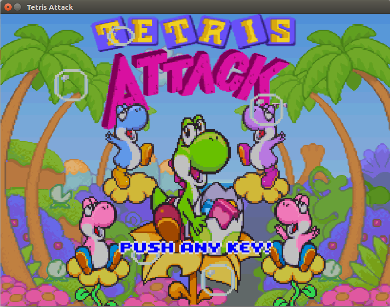

# Tetris Attack (Java)

**Conception docs (in French)**: [Conception docs](RapportFinal/rapport.pdf)  

Project developed during my second year at university using Java.

We were asked to develop a java version of the game called [Tetris Attack](https://en.wikipedia.org/wiki/Tetris_Attack) released in 1996.
